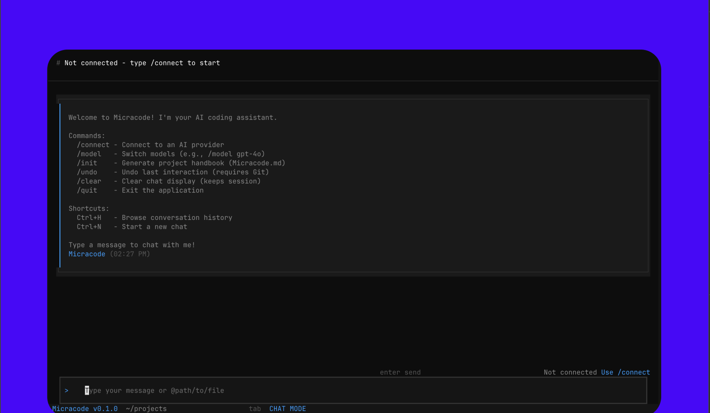

# Micracode

A modern, Claude code CLI-style terminal application for AI-assisted coding. Built with [Textual](https://textual.textualize.io/) for a beautiful TUI experience and powered by [LangChain](https://langchain.com/) + [LangGraph](https://langchain.com/langgraph) for intelligent agent capabilities.



## ✨ Features

- **Multi-Provider Support** - Connect to Gemini, OpenAI, or Anthropic with your API keys
- **Real-time Streaming** - See AI responses as they're generated
- **File Operations** - Read, write, and search files directly from the chat
- **Interactive Diffs** - Review and accept/reject proposed code changes
- **Session Management** - Save, browse, and restore conversation history (Ctrl+H)
- **Git Integration** - Undo last interaction with `/undo` (requires Git)
- **Project Context** - Generate AI handbook with `/init` command
- **File Mentions** - Reference files with `@filename` syntax

## 🚀 Quick Start

### Prerequisites

- Python 3.13+
- [uv](https://docs.astral.sh/uv/) package manager

### Installation

```bash
# Clone the repository
git clone https://github.com/YOUR_USERNAME/micracode.git
cd micracode

# Install dependencies with uv
uv sync

# Run the application
uv run micracode
```

### One-line Install (via script)

```bash
curl -sSL https://raw.githubusercontent.com/YOUR_USERNAME/micracode/main/install.sh | bash
```

## 📖 Usage

### Commands

| Command | Description |
|---------|-------------|
| `/connect` | Connect to an AI provider (Gemini, OpenAI, Anthropic) |
| `/model <name>` | Switch models (e.g., `/model gpt-4o-mini`) |
| `/init` | Generate project handbook (Micracode.md) |
| `/undo` | Undo last interaction (requires Git repository) |
| `/clear` | Clear chat display (keeps session history) |
| `/quit` | Exit the application |

### Keyboard Shortcuts

| Shortcut | Action |
|----------|--------|
| `Ctrl+H` | Browse conversation history |
| `Ctrl+N` | Start a new chat session |
| `Ctrl+C` | Quit the application |
| `Escape` | Quit the application |

### File Mentions

Reference files in your messages using the `@` syntax:

```
Can you refactor @src/utils.py to use async functions?
```

## 🤖 Supported Providers

| Provider | Default Model | Available Models |
|----------|---------------|------------------|
| **Gemini** | gemini-2.5-flash | gemini-2.5-pro, gemini-2.5-flash, gemini-2.0-flash, gemini-1.5-pro, gemini-1.5-flash |
| **OpenAI** | gpt-4o | gpt-4o, gpt-4o-mini, gpt-4-turbo, gpt-4, o1, o1-mini, o3-mini |
| **Anthropic** | claude-sonnet-4-20250514 | claude-sonnet-4-20250514, claude-3-5-sonnet-20241022, claude-3-5-haiku-20241022, claude-3-opus-20240229 |

## 🏗️ Project Structure

```
micracode/
├── main.py              # Application entry point
├── agent/               # LangGraph agent implementation
│   ├── graph.py         # Agent graph definition
│   ├── nodes.py         # Agent node functions
│   └── state.py         # Agent state schema
├── component/           # Textual UI components
│   ├── chat.py          # Chat scroll widget
│   ├── connect_modal.py # Provider connection modal
│   ├── message.py       # Message display widget
│   ├── header.py        # App header bar
│   └── ...              # Additional UI components
├── config/              # Configuration management
│   ├── store.py         # API key storage
│   └── session_store.py # Session persistence
├── llm/                 # LLM provider abstraction
│   └── models.py        # Model factory
├── tools/               # Agent tools
│   ├── file_ops.py      # File operations
│   ├── search.py        # Code search
│   ├── git_utils.py     # Git integration
│   └── ...              # Additional tools
├── pyproject.toml       # Project configuration
└── uv.lock              # Dependency lock file
```

## 🔧 Development

```bash
# Install dependencies
uv sync

# Run in development mode
uv run python main.py

# Or use the entry point
uv run micracode
```

## 📦 Dependencies

- **textual** - Modern TUI framework
- **langchain-google-genai** - Gemini integration
- **langchain-openai** - OpenAI integration  
- **langchain-anthropic** - Anthropic integration
- **langgraph** - Agent graph framework

## 📄 License

MIT License - see [LICENSE](LICENSE) for details.
